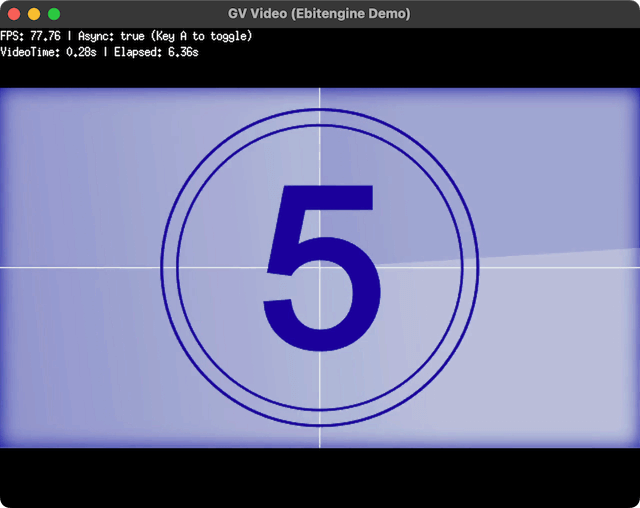

# ebiten_gvvideo



GV video ([Extreme Gpu Friendly Video Format](https://github.com/Ushio/ofxExtremeGpuVideo)) player for [Ebitengine](https://ebitengine.org/), using [go-gv-video](https://github.com/funatsufumiya/go-gv-video).

( Partial port from [bevy_movie_player](https://github.com/funatsufumiya/bevy_movie_player) )

> [!WARNING]
> Go port was almost done by GitHub Copilot. Use with care.

> [!NOTE]
> Latest version is using SIMD. If you need Pure Go implementation without SIMD, use `v0.0.4-no-simd` or `no-simd`

## Example

```bash
$ git clone https://github.com/funatsufumiya/ebiten_gvvideo
$ cd ebiten_gvvideo
$ go run ./example/main.go

# with your GV video:
$ go run ./example/main.go [path/to/video.gv]

# with your multiple GV video:
$ go run ./example_multiple/main.go [path/to/video_folder]
```

## What's GV video?

see [ofxExtremeGpuVideo](https://github.com/Ushio/ofxExtremeGpuVideo).

Note that you can use **alpha channel (opacity)** in your GV video. PNG sequences can be converted into .gv file.

## Limitation

Currently CPU decoding `DXT1/DXT3/DXT5` compressed data into `RGBA`, because Ebitengine now doesn't provide GPU compressed texture assignment ([ebiten#867](https://github.com/hajimehoshi/ebiten/issues/867)).
